# 🌦️ Climate Analytics Dashboard: AWS S3 → Snowflake → Power BI

> **A comprehensive Business Intelligence solution showcasing cloud-native data architecture and interactive analytics**

[](https://aws.amazon.com/s3/)
[](https://www.snowflake.com/)
[](https://powerbi.microsoft.com/)
[](https://www.sql.org/)

## 🎯 Project Overview

This project demonstrates a **modern Business Intelligence architecture** using leading cloud technologies. I built an end-to-end solution that processes climate data through AWS S3, Snowflake Data Warehouse, and Power BI to deliver actionable insights on weather patterns, crop impacts, and seasonal trends.

### 🔍 What Makes This Project Stand Out?
- **Cloud-Native Architecture**: Leveraging industry-standard cloud services
- **Real-World Business Application**: Addresses agricultural and climate analysis needs
- **Scalable Design**: Built to handle large datasets with enterprise-grade tools
- **Interactive Analytics**: Dynamic dashboards with comprehensive filtering capabilities

## 🚀 Key Features

- ✅ **Cloud Data Storage** - Secure, scalable data hosting on AWS S3
- ✅ **Enterprise Data Warehouse** - High-performance processing with Snowflake
- ✅ **Interactive Dashboards** - Rich visualizations with Power BI
- ✅ **Multi-Dimensional Analysis** - Rainfall, temperature, humidity, and crop insights
- ✅ **Dynamic Filtering** - Region, season, crop, and time-based exploration
- ✅ **Automated Data Loading** - Streamlined ETL processes with SQL

## 🛠️ Technology Stack

| Layer | Technology | Purpose |
|-------|------------|---------|
| **Storage** | AWS S3 | Raw data repository |
| **Processing** | Snowflake | Data warehouse & transformation |
| **Analytics** | SQL | Data querying & manipulation |
| **Visualization** | Power BI | Interactive dashboards |
| **Integration** | External Stages | Seamless data connectivity |

## 🏗️ Architecture Overview

```mermaid
graph TD
    A[📄 Raw CSV Data] --> B[☁️ AWS S3 Bucket]
    B --> C[🏭 Snowflake External Stage]
    C --> D[🗄️ Snowflake Data Warehouse]
    D --> E[📊 Power BI Dashboard]
    E --> F[👥 End Users]
    
    style A fill:#e1f5fe
    style B fill:#fff3e0
    style C fill:#f3e5f5
    style D fill:#f3e5f5
    style E fill:#fff8e1
    style F fill:#e8f5e8
```



## 📊 Dashboard Insights & Analytics

### 🌧️ **Rainfall Analysis**
- **Regional Comparison**: Visual breakdown of precipitation patterns across different areas
- **Seasonal Trends**: Identification of wet and dry seasons with historical context
- **Deficit/Surplus Detection**: Automated highlighting of areas with abnormal rainfall

### 🌡️ **Temperature Monitoring**
- **Seasonal Averages**: Temperature variations across different seasons
- **Regional Heat Maps**: Geographic temperature distribution visualization
- **Extreme Weather Alerts**: Detection of temperature anomalies affecting agriculture

### 💧 **Humidity Tracking**
- **Monthly Patterns**: Humidity level changes throughout the year
- **Crop Correlation**: Relationship between humidity and crop growth conditions
- **Optimal Range Identification**: Highlighting ideal humidity zones for different crops

### 🌾 **Agricultural Impact Assessment**
- **Crop Suitability Analysis**: Weather pattern impact on different crop categories
- **Regional Recommendations**: Data-driven insights for crop selection by area
- **Seasonal Planning**: Optimal planting and harvesting time predictions

### 🎛️ **Interactive Features**
- **Dynamic Filters**: Region, crop type, month, and year selections
- **Drill-Down Capability**: From overview to detailed analysis
- **Real-Time Updates**: Instant chart updates based on filter selections
- **Export Functionality**: Data export for further analysis

## 📁 Project Architecture

```
climate-dashboard-aws-snowflake-powerbi/
│
├── 📊 dataset/
│   └── climate_data.csv                 # Source climate dataset
│
├── ☁️ aws/
│   ├── s3_upload_steps.md              # AWS S3 setup documentation
│   └── s3_bucket_structure.png         # S3 bucket organization
│
├── 🏭 snowflake/
│   ├── create_table.sql                # Table creation scripts
│   ├── copy_into_snowflake.sql         # Data loading queries
│   └── snowflake_stage_setup.md        # External stage configuration
│
├── 📈 powerbi/
│   └── ClimateDashboard.pbix           # Power BI dashboard file
│
├── 📸 screenshots/
│   ├── rainfall_dashboard.png          # Rainfall analysis view
│   ├── temperature_dashboard.png       # Temperature monitoring view
│   └── humidity_dashboard.png          # Humidity tracking view
│
└── 📋 README.md                        # Project documentation
```


## 🎯 Skills Demonstrated

### **Cloud Technologies**
- **AWS S3**: Bucket management, security configurations, data organization
- **Snowflake**: External stages, data warehousing, query optimization
- **Cloud Integration**: Seamless connectivity between cloud services

### **Data Engineering**
- **ETL Processes**: Extract, Transform, Load operations
- **Data Modeling**: Efficient schema design and relationships
- **SQL Proficiency**: DDL, DML, and advanced querying techniques

### **Business Intelligence**
- **Power BI Development**: Advanced visualizations and DAX calculations
- **Dashboard Design**: User experience and interactive elements
- **Business Analysis**: Converting data into actionable insights

### **Technical Skills**
- **Data Architecture**: End-to-end solution design
- **Performance Optimization**: Query tuning and efficient data loading
- **Documentation**: Comprehensive project documentation

## 📈 Project Impact

- **Scalability**: Architecture supports thousands of records with sub-second query performance
- **Business Value**: Enables data-driven agricultural and climate decisions
- **Cost Efficiency**: Optimized cloud resource usage with Snowflake's consumption model
- **User Experience**: Intuitive dashboards accessible to non-technical stakeholders

## 🚀 Future Enhancements

- [ ] **Real-Time Data Streaming** - Implement AWS Kinesis for live climate updates
- [ ] **Machine Learning Integration** - Add predictive analytics for crop yield forecasting
- [ ] **Mobile Dashboard** - Power BI mobile app optimization
- [ ] **API Development** - REST API for external data consumption
- [ ] **Advanced Analytics** - Statistical modeling and trend analysis
- [ ] **Multi-Source Integration** - Incorporate satellite and IoT sensor data


## 👨‍💻 About the Developer

**Abhay Dahe** - Cloud Data Engineer & BI Developer

- 🔗 **LinkedIn**: [Connect with me](https://linkedin.com/in/abhay-dahe)
- 📧 **Email**: [abhaydahe2206@gmail.com](abhaydahe2206@gmail.com)

---


*This project demonstrates practical application of modern cloud data architecture and showcases ability to build enterprise-grade Business Intelligence solutions.*

---

⭐ **If this project helped you understand cloud BI architecture, please give it a star!** ⭐

